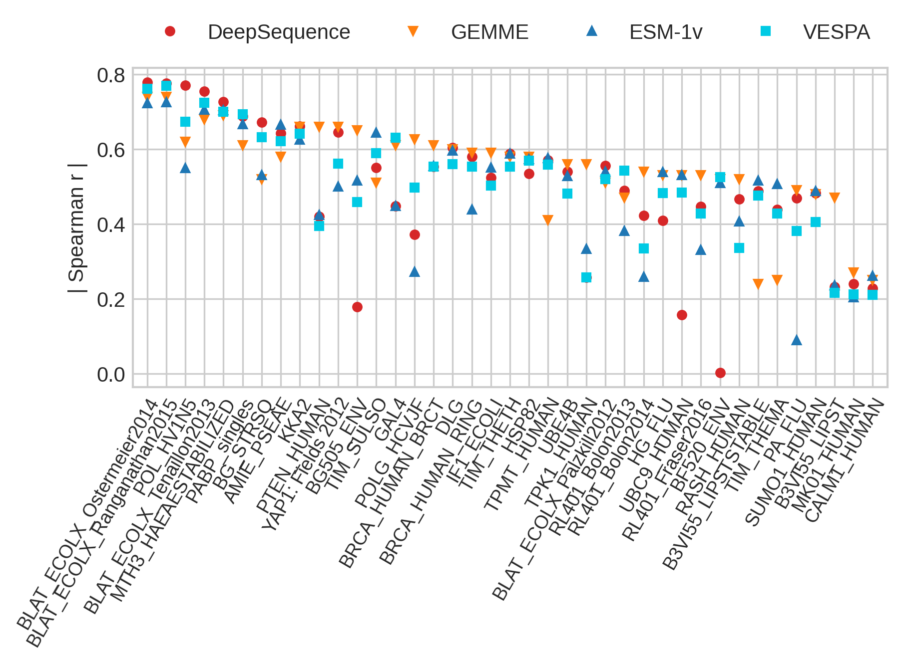

<details>
  <summary markdown="span"> <u><b>Table of Contents</u></b> </summary>

[[_TOC_]]

</details>

# VESPA -- **V**ariant **E**ffect **S**core **P**rediction without **A**lignments

**VESPA** is a simple, yet powerful Single Amino Acid Variant (SAV) effect predictor based on embeddings of the Protein Language Model [ProtT5](https://github.com/agemagician/ProtTrans).

The single-sequence-based SAV effect prediction is set up in a multistage pipeline that includes (1) generating `ProtT5` embeddings, (2) extracting per-residue conservation predictions, (3) (optionally) extracting per-variant log-odds ratios, and (4) predicting the effect of all possible amino acid substitutions. Step (4) can be completed by either using **VESPA** with (2) and (3) as input, or by using the computationally more efficient method VESPA-light (**VESPAl**) with only step (2) as input for a small drop in prediction performance.

The specifics of **VESPA** and **VESPAl** can be found in our paper, [_Embeddings from protein language models predict conservation and variant effects_ (Marquet et al., 2021)](https://doi.org/10.1007/s00439-021-02411-y). The performance of **VESPA** when evaluated against SOTA methods can be seen below.
<div align="center"></div>

## Precomputed VESPA and VESPAl predictions

Precomputed **VESPA** and **VESPAl** predictions are currently available for 39 _DMS experiments_ here:  [_Supplementary file 3 of (Marquet et al., 2021)_](https://doi.org/10.1007/s00439-021-02411-y). Furthermore, **VESPAl** predictions are available for the [_human proteome_](https://doi.org/10.5281/zenodo.5905863) (downloaded 22/01/17), and for the [__fly (drosophila melanogaster) proteome__](https://doi.org/10.5281/zenodo.6322184) (downloaded 22/03/01).

## Usage

The preferred method to install **VESPA** is via pip:

```bash
pip install vespa-effect
```

-----

### Input Files

**Required**: A single `FASTA` file containing all your wildtype sequences (note: this file can contain any number of sequences).

**Optional**: If you are only interested in a subset of possible mutations (specific mutations), you can add `-m mutations.txt` to the code line in [Quickstart](#Quickstart) (note: per default all mutations are considered). Click [`here`](#mutations-file) to head to the file format explanation of `mutations.txt`.

-----

### Quickstart

For simplicity of this guide, we will assume a folder containing all data: f.e., the `FASTA` file is placed at `data/sequences.fasta` and the (optional) `mutations.txt` at `data/mutations.txt`.

After installing the repository, you can run the following:

```bash
vespa data/sequences.fasta --prott5_weights_cache data/cache
```

By default, this runs **VESPAl** for all possible mutations. It will generate a new folder _vespa_run_directory_ in your current working directory. Within this folder you will find two files containing input features (embeddings, conservation prediction) and an _output_ folder with .csv files containing **VESPAl** predictions for each sequence with all possible mutations. More details can be found under [output](#vespa-and-vespal-output).

**WARNING** Creating embeddings requires a powerful GPU (we recommend at least 12GB of VRAM). The same applies to running **VESPA**. For more details, see [Step 1 on generating embeddings](#step-1-extracting-prott5-embeddings) and [Step 3 on extracting log-odds ratios](#step-3-log-odds-ratio-of-masked-marginal-probabilities).

**Optional**:

- If you already have precomputed embeddings available, you can use those instead of generating new ones by adding `--use_existing_embeddings` followed by the file location. Then running **VESPAl** will not require a GPU.
- If you have a GPU available you can generate **VESPA** predictions by adding `--vespa` to the code line above. After running **VESPA** you will find another file in your folder _vespa_run_directory_ containing log-odds ratios as additional input.
- `--prott5_weights_cache` followed by a folder path specifies the location of a caching folder (or preloaded ProtT5 weigths). Instead of downloading the weights for every run of **VESPA** and/or **VESPAl**, the weights will be downloaded into this folder or just reused if already present.
- In case you want to output a single [.h5 file](#.h5 files) in addition to the default .csv files with predictions, add `--h5_output` followed by the output file location. If you are only interested in an .h5 file, add `--no_csv`.

Below you can find information on how to run each step of **VESPA** and **VESPAl** individually.
Running the vespa script will automatically the substeps below for you (with the optional specifications you of your choice). Use the substeps if you are interested in a particular intermediate result.

-----

### The substeps of VESPA and VESPAl

The following steps can be run individually and for any number of sequences contained in a `FASTA` file.

#### Step 1: Extracting ProtT5 embeddings

To run **VESPA** and/or **VESPAl** to obtain SAV predictions, you will need the `ProtT5` embeddings of your sequences. If you have a GPU, you can use the included embedding script on your own machine to generate your protein embeddings:

```bash
vespa_emb data/sequences.fasta -o data/embeddings.h5  --prott5_weights_cache data/cache

```

As you can see, you need to specify an output file location (`-o`), and the `FASTA` file location of your input sequences.

**Optional**: `--prott5_weights_cache` specifies a caching directory to store `ProtT5` weights. If not present, the line above will download the weights to your current working directory for every run of **VESPA** and/or **VESPAl**.

#### Step 2: Conservation Prediction

**VESPA** and **VESPAl** take per-residue conservation predictions as input. To generate them, run the following (in the `VESPA` folder):

```bash
vespa_conspred data/embeddings.h5 -o data/conspred.h5
```

The input for our conservation predictor are the `ProtT5` embeddings. In your output file (`-o`), you will find 9-state conservation probabilities (per-residue) needed as input for the models. For more details on the conservation prediction please see the paper mentioned above.

**Optional**: In case you are interested in generating a file that contains the predicted conservation classes instead of the assigned class probabilities, add `--output_classes` above.

#### Step 3: Log-odds ratio of masked marginal probabilities

This step requires a GPU! The two models **VESPA** and **VESPAl** differ in their predictive performance but also in the required input. If you are only interested in running **VESPAl**, you can skip this step.

To generate the log-odds ratios of masked marginal probabilities required for **VESPA**, run (in the `VESPA` folder):

```bash
vespa_logodds data/sequences.fasta -o data/logodds.h5 
```

**Optional**:

- To run the log-odds script including the mutations file, add `-m data/mutations.txt` to the code line above.
- Per default the command above generates the [`.h5` file](#h5-files) required for the subsequent steps. We provide two options to output a human readable version of the log-odds scores by adding `--single_csv data/single_logodds.csv` or `--csv_dir data/csv_dir/` at the end of the code line above. The first option generates a single csv file with all sequences and SAVs. For large sets, we recommend to use the second option, which outputs multiple csv files separated by sequence ID of the given `FASTA` file. The format of the .csv files is described [below](#log-odds-ratio-output).

#### Step 4: Run **VESPA** and/or **VESPAl**

Now you have all the data required to run **VESPA** and/or **VESPAl**. Per default, the `vespa` script will predict SAV effects for **VESPAl** only. To explicitly enable **VESPA** add `--vespa` (which will run both models), and to disable **VESPAl** add `--no-vespal`. To generate predictions, execute the following code (in the `VESPA` folder):

- **Both** (if you computed the conservation prediction and the log-odds):

    ```bash
    vespa_run --vespa data/conspred_probs.h5 data/sequences.fasta --T5_input data/logodds.h5 --output predictions/
    ```

- **Only VESPA** (if you computed the conservation prediction and the log-odds):

    ```bash
    vespa_run --vespa --no-vespal data/conspred_probs.h5 data/sequences.fasta -T5_input data/logodds.h5 --output predictions/
    ```

- **Only VESPAl** (if you only computed the conservation prediction):

    ```bash
    vespa_run data/conspred_probs.h5 data/sequences.fasta --output predictions/
    ```

**Optional**: In case you want to output a single [.h5 file](#.h5 files) in addition to the default .csv files with predictions, add `--h5_output` followed by the output location. If you are only interested in an .h5 file, add `--no_csv` and drop `--output predictions/`. More details can be found under [output](#vespa-and-vespal-output).

**Note:** The format of the results file is described below at [VESPA and VESPAl output](#vespa-and-vespal-output).

-----

### Additional Information

#### Extracting raw reconstruction probabilities

You might be interested in extracting the raw reconstruction probabilities for each mutation position from `ProtT5`. These raw reconstruction probabilities are used to calculate the log-odds ratio and is explained in more detail in the corresponding publication.
To do so, use:

```bash
vespa_logodds -r --reconstruction_output data/reconstruction_probas data/sequences.fasta -o data/logodds.h5 
```

**Optional**: Add a mutations file.

The generated datasets in the [`.h5` file](#h5-files) contain probability vectors that determine the reconstruction probabilities for all amino acids sorted according to the `MUTATION_ORDER` in `config.py`. If a particular mutation was not computed (i.e., the position was not present in the `mutation.txt`) it contains -1.

#### File Specifications

This section describes relevant file formats for **VESPA** and **VESPAl**:

##### Mutations file

A simple text file with a protein ID and one mutation per-line (i.e., mutations separated by \n for newline).
Every mutation should be specified by `<PROTEIN_ID>_<SAV-String>` separated by an underscore. The default `<SAV-String>` has the following format `<fromAA><0-basedSequencePosition><toAA>`.

The sequence ID needs to be equivalent to the one in the sequence `FASTA` file.
The SAV string has the format: `<Original Amino Acid><Position><Replacement Amino Acid>`

Example:

```txt
ENSP00000355206_I0L
ENSP00000355206_I0V
ENSP00000355206_I0L
ENSP00000355206_I0K
ENSP00000355206_I0T
```

**Optional:** In case you have a file with 1-based mutations, add the flag `--one_based_mutations`.

##### `.h5` files

Multiple scripts generate `.h5` files. These files follow the [`hdf5`-standard](https://www.hdfgroup.org/solutions/hdf5)
and can be processed in python using the library [`h5py`](https://www.h5py.org/). Generally, the files are segmented into datasets that can be accessed using the protein accession in the `FASTA` file. The datasets are explained in more detail in the respective _output sections_.

##### Conservation output

The conservation prediction will output an .h5 file with the predicted 9-state conservation probabilities. For each ID of the `FASTA` file, the respective dataset contains a matrix of size 9xL, with L being the length of the protein sequence, and 9 being the predicted conservation class (index 0 = very variable; index 8 = very conserved).

Additionally, you can extract a file with per-residue conservation class predictions for each sequence directly.

##### Log-odds ratio output

The default output is an .h5 file that contains one Lx20 matrix per sequence. -1 means no log-odds ratio was computed for the respective mutation.

When running `--single_csv data/single_logodds.csv`, the log-odds ratio output file contains all mutations (or the mutations determined by the mutations file) as `<PROTEIN_ID>_<SAV-String>`, followed by a `;` and the log-odds ratio for a particular mutation per line.

Example:

```csv
B3VI55_LIPSTSTABLE_A438Q;0.053829677402973175
B3VI55_LIPSTSTABLE_A438N;0.061238136142492294
B3VI55_LIPSTSTABLE_A438Y;0.012603843584656715
B3VI55_LIPSTSTABLE_A438M;0.012212143279612064
B3VI55_LIPSTSTABLE_A438H;0.0241163931787014
B3VI55_LIPSTSTABLE_A438W;0.004520446062088013
```

In case the predictions are written into a directory, e.g. by specifying `--csv_dir` in [Step 3](#step-3-log-odds-ratio-of-masked-marginal-probabilities), the script will create one file per sequence, named by sequence ID (note: the ID will be normalized, i.e, each special character will be replaced by `_`).
The file will contain one `<Mutation-String>;score` per-line.

Example file called `B3VI55_LIPSTSTABLE`:

```csv
A438Q;0.053829677402973175
A438N;0.061238136142492294
A438Y;0.012603843584656715
A438M;0.012212143279612064
A438H;0.0241163931787014
A438W;0.004520446062088013
```

##### VESPA and VESPAl output

The default output of **VESPA** and/or **VESPAl** will generate one .csv file per protein in the output folder of `vespa_run_directory`. If you specified an output directory with `--output`, you will find the .csv files there.
To circumvent naming issues due to long sequence ID's, the csv files will be numbered by sequence occurrence in the `FASTA` file. A lookup file `map.json` will be created in the output directory containing a dictionary mapping from number to sequence ID.

Example `map.json`:

```json
{    "0": "B3VI55_LIPSTSTABLE",
    "1": "BF520_ENV",
    "2": "BG_STRSQ",
    "3": "BG505_ENV",
    "4": "HG_FLU",
    "5": "MTH3_HAEAESTABILIZED"}
```

The individual files will contain rows with the mutations (format: `<fromAA><0-basedSequencePosition><toAA>`) along with the respective predictions of **VESPA** and/or **VESPAl**.

Example `0.csv`:

```csv
Mutant;VESPAl;VESPA
M0A;0.4457732174287125;0.3520255108578212
M0L;0.3191178420567241;0.2717188481387661
M0G;0.5355136080284415;0.4110670843315182
M0V;0.3594337197937546;0.2971971641898669
M0S;0.4457732174287125;0.35202555423053
M0R;0.4457732174287125;0.35202621644931126
```

If you chose to generate an .h5 output, the ID's will be the original `FASTA` ID's. The file contains one 20xL-shaped matrix per sequence-ID. L is the length of the respective protein length, and 20 is the possible number of amino acid variants (including self). The order of amino acids is determined by `MUTANT_ORDER` in `predict/config.py` (`ALGVSREDTIPKFQNYMHWC`). Empty fields that were not calculated/specified (f.e., wildtype substitutions) contain a -1.

-----

## Development Roadmap

- [ ] Write comprehensive tests
- [x] Publish pypi package
- [x] Install from github release
- [ ] Contributing guidelines

-----

## Installation from current Github Release

**WARNING Experimental**: To install the current release from github you can use:

```bash
python -m pip install https://github.com/Rostlab/VESPA/releases/download/v0.9.0-beta/vespa-0.9.0b0.tar.gz
```

-----

## Cite

If you want to credit us, feel free to cite

Marquet, C., Heinzinger, M., Olenyi, T. et al. Embeddings from protein language models predict conservation and variant effects. Hum Genet (2021). <https://doi.org/10.1007/s00439-021-02411-y>

```Bibtex
@article{Marquet2021,
  doi = {10.1007/s00439-021-02411-y},
  url = {https://doi.org/10.1007/s00439-021-02411-y},
  year = {2021},
  month = dec,
  publisher = {Springer Science and Business Media {LLC}},
  author = {C{\'{e}}line Marquet and Michael Heinzinger and Tobias Olenyi and Christian Dallago and Kyra Erckert and Michael Bernhofer and Dmitrii Nechaev and Burkhard Rost},
  title = {Embeddings from protein language models predict conservation and variant effects},
  journal = {Human Genetics}
}
