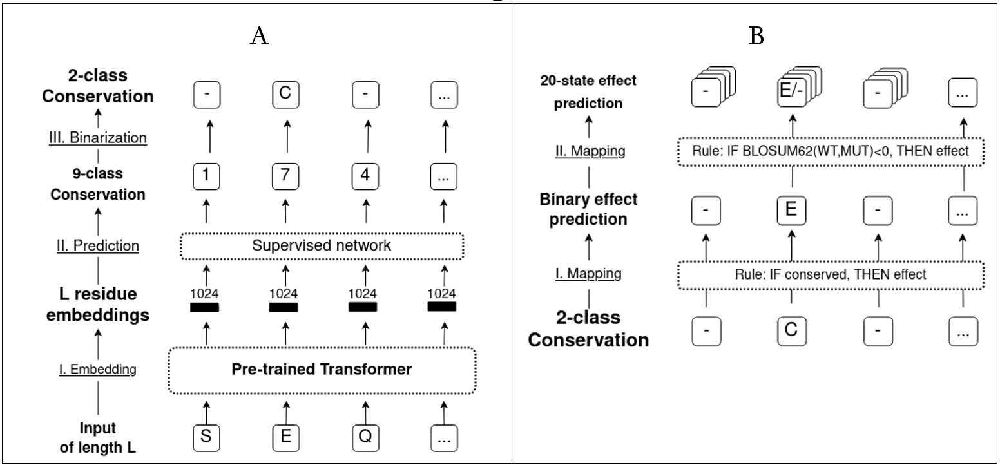

# VESPA -- **V**ariant **E**ffect **S**core **P**rediction without **A**lignments

**VESPA** is a simple, yet powerful Single Amino Acid Variant (SAV) effect predictor based on embeddings of the Protein Language Model [ProtT5](https://github.com/agemagician/ProtTrans).

The single-sequence-based SAV effect prediction is set up in a multistage pipeline that includes (1) generating ProtT5 embeddings, (2) extracting per-residue conservation predictions, (3) (optionally) extracting per-variant log odds ratios, and (4) predicting the effect of all possible amino acid substitutions. Step (4) can be completed by either using **VESPA** with (2) and (3) as input, or by using the computationally more efficient method VESPA-light (**VESPAl**) with only step (2) as input for a small drop in prediction performance.

The specifics of **VESPA** and **VESPAl** can be found at _Embeddings from protein language models predict conservation and variant effects_
[DOI: 10.21203/rs.3.rs-584804/v1](https://doi.org/10.21203/rs.3.rs-584804/v1)

  


## Usage

We try to make the usage of **VESPA** as simple as possible. Hence we are working on publishing a
python package that brings SAV Effect prediction to you as a `pip install` command.
However, we are not quite there yet (Package will be published as soon as we have comprehensive
tests).

For the meantime, we recommend using `git` to clone the package and
[`poetry`](https://python-poetry.org/) to run it.

The following steps can be run for any number of sequences contained in a FASTA file.

### Required Input Files

In order to work with `VESPA` you will need to have a single `fasta` file containing all your wildtype sequences.
If you are only interested in a subset of possible mutations (specific mutant sequences), you will also need a [`mutations.txt`](#mutations-file) as described below.
For the purpose of the following guid we will assume the `fasta` file is placed at `data/sequences.fasta` and the `mutations.txt` at `data/mutations.txt`

### Step 1: Extracting ProtT5 embeddings

To run **VESPA** and obtain SAV predictions, you will need the `protT5` embeddings of your sequences. These you can generate using the [embed.protein.properties](https://embed.protein.properties/) server (make sure to select `ProtTrans T5 XL U50 (ProtT5)`).

Alternatively, if you have a powerful GPU (we recommend at least 12GB of VRAM), you can use `bio-embeddings` on your own machine
to generate your own protein embeddings. For this, you can just install the latest `bio-embeddings` (`pip install bio-embeddings[all]`) or using docker (see: [documentation](https://pypi.org/project/bio-embeddings/))

We suggest you add a python file to the `VESPA` (top-level) folder with the following code:

```python
from pathlib import Path

import h5py
import tqdm
from bio_embeddings.embed import prottrans_t5_embedder

from vespa.predict.config import CACHE_DIR
from vespa.predict.utils import parse_fasta_input

FASTA_FILE = Path("data/sequences.fasta")
BATCH_SIZE = 4000  # Max residues per batch; This depends on your GPU VRAM
OUTPUT_FILE = Path("data/embeddings.h5")

seq_dict = parse_fasta_input(FASTA_FILE)
embedder = prottrans_t5_embedder.ProtTransT5XLU50Embedder(
    half_model=True, cache_dir=CACHE_DIR
)
dict_keys = list(seq_dict.keys())

with h5py.File(str(OUTPUT_FILE.resolve()), "w") as out_file:
    idx = 0
    for embedding in tqdm.tqdm(
        embedder.embed_many(seq_dict.values(), BATCH_SIZE),
        desc="generating embeddings",
    ):
        print(type(embedding), embedding.shape)
        out_file.create_dataset(dict_keys[idx], data=embedding)
        idx += 1
```

### Step 2: Conservation Prediction

**VESPA** and **VESPAl** take per-residue conservation probabilities as input. To generate them, run the following (in the `VESPA` folder):

```bash
poetry run vespa_conspred --no-output_classes data/embeddings.h5 -o data/conspred
```

This will generate the required conservation probabilities needed for the models. In case you are interested in generating a file that contains assigned conservation classes as well, just remove the `--no-output_classes` flag. For more details on the conservation prediction please see the pre-print mentioned above.

### Step 3: (Optional) Log odds ratio of masked marginal probabilities

**WARNING** This step requires a powerful GPU!

We provide two versions of **VESPA**: **VESPA** and **VESPAl**. They differ in their
predictive performance but also in the required input. If you are only interested to run
**VESPAl**, you can skip this step.

To generate the logodds required for **VESPA**, run (in the `VESPA` folder):

```bash
poetry run vespa_logodds -o data/logodds.h5 data/sequences.fasta
```

**WARNING** This will compute the log odds ratio for every possible SAV of a sequence and thus can take a long time. In case you are only interested in specific mutations, especially when generating output for a large number of sequences or long sequences, we recommend to include a _mutations file_. The file format is described below. To run the log odds script including the mutations file, use:

```bash
poetry run vespa_logodds -o data/logodds.h5 -m data/mutations.txt data/sequences.fasta
```

We provide two options to output a human readable version of the log odds scores by adding `--single_csv data/single_logodds.csv` or `--csv_dir datat/csv_dir/` at the end of the code line above. The first option generates a single csv file with all sequences and SAVs. For large sets, we recommend to use the second option, which outputs multiple csv files separated by sequence ID of the given FASTA file.
The format of the csv files is described below.

### Step 4: Run **VESPA** and/or **VESPAl**

Now you have all the data available to run **VESPA** and/or **VESPAl**. Per-default, the `vespa` script will predict SAV effects using both models. To explicitly disable one model, add `--no-vespa/ --no-vespal`. To generate predictions, execute the following code (in the `VESPA` folder):

- **Both** (if you computed the conservation prediction and the logodds):

    ```bash
    poetry run vespa -v data/conspred_probs.h5 data/sequences.fasta -T5_input data/logodds.h5 -m data/mutations.txt --output predictions/
    ```

- **Only VESPA** (if you computed the conservation prediction and the logodds):

    ```bash
    poetry run vespa -v --no-vespal data/conspred_probs.h5 data/sequences.fasta -T5_input data/logodds.h5 -m data/mutations.txt --output predictions/
    ```

- **Only VESPAl** (if you only computed the conservation prediction):

    ```bash
    poetry run vespa -v --no-vespa data/conspred_probs.h5 data/sequences.fasta -m data/mutations.txt --output predictions/
    ```

**Note:** Running VESPA automatically generates predictions for both models.
The format of the results file is described below at *VESPA and VESPAl output*

### Extracting the raw reconstruction probabilities

You might be interested in extracting the raw reconstruction probabilities for each mutation position from T5.
To do so, use:

```bash
poetry run vespa_logodds -r --reconstruction_output data/reconstruction_probas -o data/logodds.h5 -m data/mutations.txt data/sequences.fasta
```

The generated datasets in the [`.h5` file](#h5-files) will contain -1 column-vectors if the mutation position was not considered (i.e. the position was not present in the `mutation.txt`) and otherwise contain probability vectors that determine the reconstruction probabilities for all amino acids sorted according to the `MUTATION_ORDER` in `config.py`.

## File Specifications

This section describes a few relevant file formats we use for VESPA and VESPAl:

### `.h5` files

Multiple script generate `.h5` files. These files follow the [`hdf5`-standard](https://www.hdfgroup.org/solutions/hdf5)
and can be processed in python using the library [`h5py`](https://www.h5py.org/). Generally the files are segmented into datasets that can be accessed using the protein accession in the fasta file. Each dataset is matrix shaped and usually has an `NxM`-shape, where `N` is the length of the respective protein length and `M` is the possible number of mutants (including self). `M` is a constant and the mutant length and mutant-order are determined by `MUTANT_ORDER` in `predict/config.py`. Empty fields that were not calculated/ specified contain a -1.


### Mutations file

A simple text file with a protein ID and one mutation per-line (i.e., mutations separated by \n for newline).
Every mutation should be specified by `<PROTEIN_ID>_<SAV-String>` separated by an underscore.

The sequence ID needs to be equivalent to the one in the sequence FASTA file.
The SAV string has the format: `<Original Amino Acid><Position><Replacement Amino Acid>`

Example:

```txt
ENSP00000355206_I1L
ENSP00000355206_I1V
ENSP00000355206_I1L
ENSP00000355206_I1K
ENSP00000355206_I1T
```

### Log odds ratio output

When running `--single_csv data/single_logodds.csv`, the log odds ratio output file contains the mutations determined by `<PROTEIN_ID>_<SAV-String>`, followed by a `;` and the log odds ratio for a particular mutation.

Example:

```csv
B3VI55_LIPSTSTABLE_A438Q;0.053829677402973175
B3VI55_LIPSTSTABLE_A438N;0.061238136142492294
B3VI55_LIPSTSTABLE_A438Y;0.012603843584656715
B3VI55_LIPSTSTABLE_A438M;0.012212143279612064
B3VI55_LIPSTSTABLE_A438H;0.0241163931787014
B3VI55_LIPSTSTABLE_A438W;0.004520446062088013
```

In case the precitions are written into a directory, e.g. by specifying `--csv_dir` in the `vespa_logodds`, the script will create one file per sequence,
named by sequence ID (note: the ID will be normalized, i.e each special char will be replaced by `_`).
The file will contain one `<Mutation-String>;score` per-line.

Example file called `B3VI55_LIPSTSTABLE`:

```csv
A438Q;0.053829677402973175
A438N;0.061238136142492294
A438Y;0.012603843584656715
A438M;0.012212143279612064
A438H;0.0241163931787014
A438W;0.004520446062088013
```

### VESPA and VESPAl output

**VESPA** and **VESPAl** will both generate one csv file per protein in the specified output directory (with `--output`).
To circumvent naming issues due to long sequence ID's, the csv files will be numbered by sequence occurence in the FASTA file. A lookup file `map.json` will be created in the output directory containing a dictionary mapping from number to sequence ID.

Example `map.json`:

```json
{
    "0": "B3VI55_LIPSTSTABLE",
    "1": "BF520_ENV",
    "2": "BG_STRSQ",
    "3": "BG505_ENV",
    "4": "HG_FLU",
    "5": "MTH3_HAEAESTABILIZED"
}
```

The individual files will contain rows with the mutations along with the respective predictions of `VESPA`, `VESPAl`, or both models.

Example `0.csv`:

```csv
Mutant;VESPAl;VESPA
M0A;0.4457732174287125;0.3520255108578212
M0L;0.3191178420567241;0.2717188481387661
M0G;0.5355136080284415;0.4110670843315182
M0V;0.3594337197937546;0.2971971641898669
M0S;0.4457732174287125;0.35202555423053
M0R;0.4457732174287125;0.35202621644931126
```

## Development Roadmap

- [ ] Write comprehensive tests
- [ ] Publish pypi package
- [x] Install from github release
- [ ] Contributing

## Installation from current Github Release

**WARNING Experimental**: To install the current release from github you can use:

```bash
python -m pip install https://github.com/Rostlab/VESPA/releases/download/v0.2.0-beta/vespa-0.2.0b0.tar.gz
```

Afterwards, all scripts are installed in your current environment and you can call them without the `poetry run` prefix.
E.g. you can run `vespa ...` instead of `poetry run vespa ...`.

## Cite

If you want to credit us, feel free to cite

```Latex
@Article{rs-584804,
author={Marquet, C{\'e}line and Heinzinger, Michael and Olenyi, Tobias and Dallago, Christian and Bernhofer, Michael and Erckert, Kyra and Rost, Burkhard}, journal={Human Genetics}, year={2021}, month={Oct}, day={15}, doi={10.21203/rs.3.rs-584804/v1}, url={https://doi.org/10.21203/rs.3.rs-584804/v1}}
```
